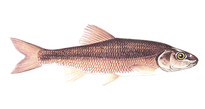
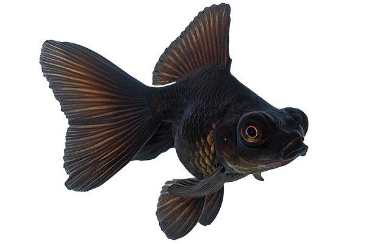
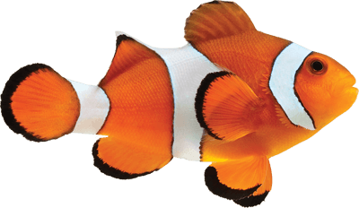
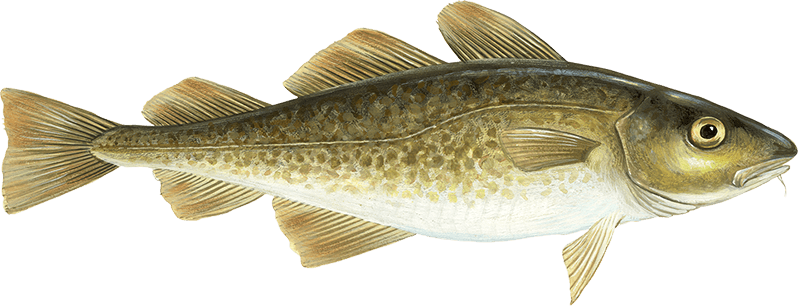
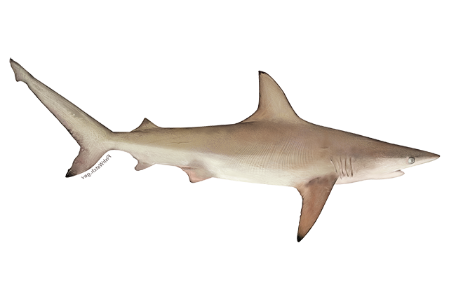
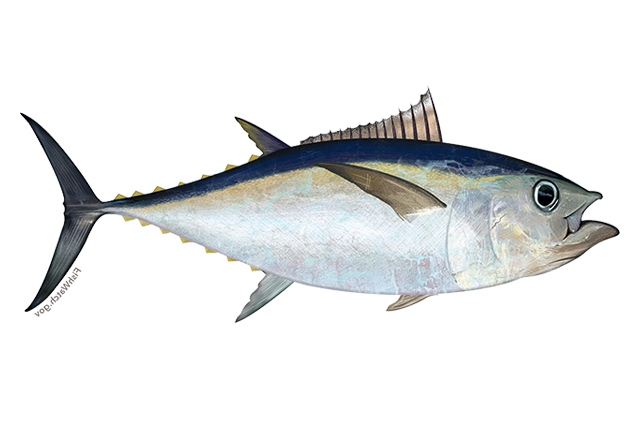
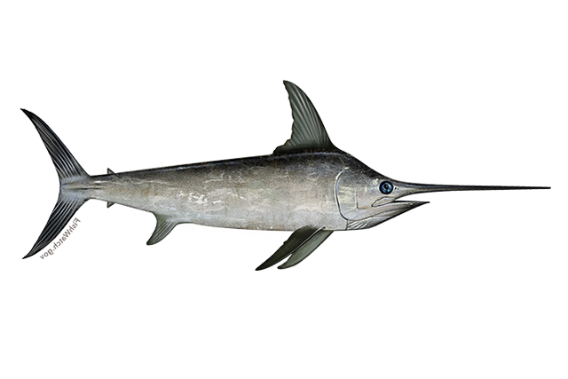
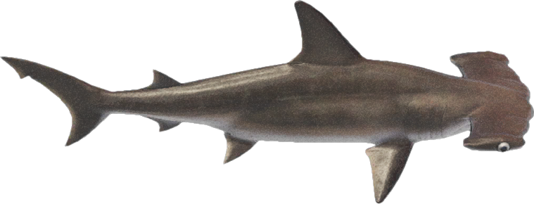
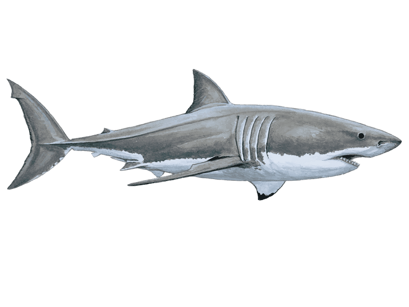
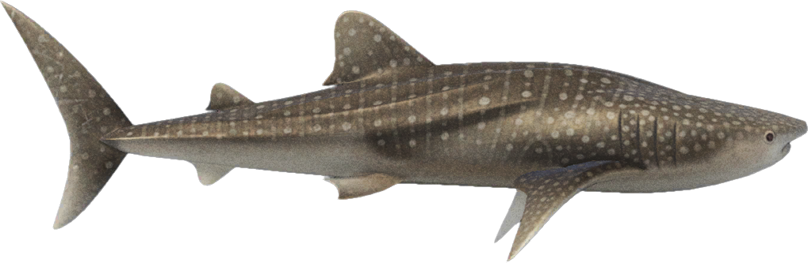

# User
[picture] of Black Goldfish
**Abilities**: Boost & Evolve
**Speed**: becomes that of what particular stage in the evolution chain you are
The user starts out as the second stage and as such is capable of eating minnows straight out the gate. As the user, you have two unique abilities to help you out on your quest of becoming the top of the food chain: boost & evolve. As the user, your goal is to evolve until stage 10 by filling your growth bar adequately. The boost will help you maneuver out of sticky situations as the ocean will become increasingly more dangerous with each fish you eat. 
Boost/Evolve Bar
Upon eating a fish you will notice that a grey bar appears towards the left edge of the game window. This bar keeps track of your growth progress towards the next evolution and resets upon reaching the next stage. The user can choose to sacrifice some of their growth progress to acquire a boost which increases the player’s speed by a factor of 1.5. The player will boost as long as they hold the space bar and have adequate growth progress. 

# AI Players
## Stage 1: Minnow

Speed: 50
FoV: 50
The first stage of evolution and what all the Ai Players initially spawn in as when the game first begins. These are tied with the Whale shark for the slowest fish and are also tied with the Whale Shark for the lowest “vision” in the game. The minnows are meant to provide the user with free food as they offer little resistance. 

## Stage 2: Black goldfish

Speed: 75
FoV: 75
The second stage of evolution is the Black Goldfish, these AI Players have the fastest speed in the game and have the largest field of view. This stage also presents no imminent threat to the user throughout the entire duration of the game

## Stage 3: Clownfish

Speed: 70
FoV: 70
The third stage of evolution is the Clownfish. They have great speed and field of view and will present the user with their first sense of danger being able to spawn after the user eats their first fish.  Its hunt for you is just an ongoing prank. 

## Stage 4: Cod 

Speed: 68
FoV: 68
The fourth stage of evolution features the Cod. This AI Player will seem like a constant thorn in your side being able to spawn after you’ve eaten your first fish and posing a threat to you until you’ve evolved twice. 

## Stage 5: Nurse Shark 

Speed: 65
FoV: 65
The fifth fish in the evolution chain is the Small Shark. This enemy will have the chance to spawn once you’ve reached Stage 3 of evolution. The nurse shark thinks that you told its parents that it was out biting humans again. Little does it know that was us. 

## Stage 6: Tuna

Speed: 65
FoV: 65
The sixth fish in the evolution chain is the Tuna and they will start spawning once the user reaches the 4th Stage of evolution. The tuna believes that you peed in its pool last Friday and doesn’t realize that it was the source of the warmth. 

## Stage 7: Swordfish

Speed: 60
FoV:  60
The seventh fish in the evolution chain is the Swordfish and they will begin spawning once the user reaches the 5th Stage of evolution. You seem to have invaded its private vacation spot, AGAIN!

## Stage 8: Hammerhead Shark

Speed: 58
FoV: 58
The eighth fish in the evolution chain is the Hammerhead and they will start spawning once the user reaches the 6th Stage of evolution. Hammerhead sees you as a way of increasing its street cred at school. It wants to be the first from its school to claim your bounty. 

## Stage 9: The Great White Shark

Speed: 55
FoV: 55
The ninth fish in the evolution chain is the Great White Shark and they will start spawning once the user reaches the 7th Stage of evolution. It has decided to put its acting career on hold to prevent you from rising up the ranks. 

## Stage 10: Whale Shark

Speed: 50
FoV: 50
The final fish in the evolution chain is the Whale Shark and they will start spawning once the user reaches the 8th Stage of evolution. Unfortunately, the biggest fish in the ocean has laid its sights on you and may have brought friends.

## Behavior States
### Common Behaviors
- Wander  
  - You will notice that all the fish move autonomously and we did our best to ensure that their movement was as fish-like as possible.

- Avoid Walls
  - You will also notice that all fish remain contained within the game window and once they come in contact with the borders they swim away as if they’re being repelled. 

#### Fish at a lower stage than you 
- Flee 
  - All fish that are at a lower stage than you are currently will display an additional behavior, “flee” whenever you enter their FoV. This behavior causes fish that you are able to eat to swim away from you until you are out of the FoV. So the fish with this additional behavior will switch between the three behavior states (“wander”, “avoid walls”, “flee”) when appropriate

#### Fish at a higher stage than you 
- Attack 
  - All fish that are at a higher stage than you are currently will display an additional behavior, “attack” whenever you enter their FoV. This behavior causes fish that are able to eat you to swim towards you as long as you’re in their FoV. So the fish with this additional behavior will switch between the three behavior states (“wander”, “avoid walls”, “attack”) when appropriate.

